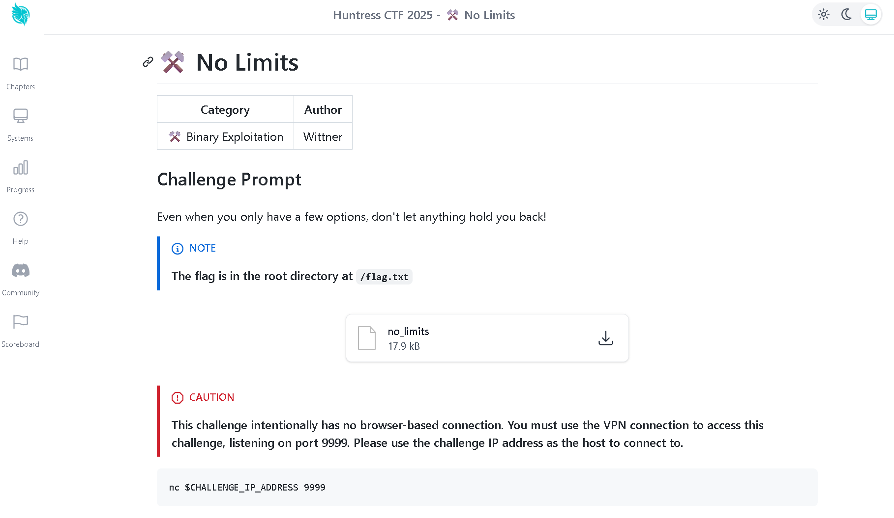
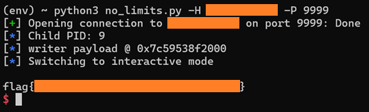

# Huntress CTF 2025 - ⚒️ No Limits Write-up

## Summary
I wasn’t planning to write anything for this CTF, but No Limits pushed me outside my normal way of thinking so I decided to share how I solved it.  
This challenge exposed a binary over VPN (port 9999). The flag lived at /flag.txt (or /root/flag.txt). The menu let me upload and execute bytes, but the parent process applied seccomp right before executing my code, which blocked the usual suspects like read, execve, and mmap. The trick? The program forks at startup and the child never gets seccomp, so you make the child do the work.  
At first glance it looked easy… then the filter proved otherwise.
### Documentation
Linux Kernel Seccomp: https://www.kernel.org/doc/html/latest/userspace-api/seccomp_filter.html
### Tools used
- [**Ghidra**](https://github.com/NationalSecurityAgency/ghidra): reversing; verified the fork/parent‑seccomp/child‑no‑seccomp design.
- [**Python 3.13.3**](https://www.python.org/): automated the menu interaction and sent newline‑safe payloads.
  - [**pwntools**](https://github.com/Gallopsled/pwntools): Python module pwntools (pip install pwntools).
## Initial Discovery
Connected with nc and saw:  
```
1) Create Memory
2) Get Debug Information
3) Execute Code
4) Exit
```
In **Ghidra** I found:  
- The program forks immediately.
- Parent shows the menu and calls a ProtectProgram() style routine that installs seccomp right before jumping to our address.
- Child runs a simple loop, including sleep(5), and never installs seccomp.

Syscalls under seccomp (parent):
- Allowed: open, write, lseek, mprotect, dup/dup2, sched_yield, fork/clone, exit, etc.
- Blocked: read, execve, mmap, sendfile.

Why normal shellcode fails
- open -> **read** -> write in the parent? **Fails** (no read).
- **execve**("/bin/sh") or /bin/cat? **Blocked**.
- **mmap**(9) tricks? **Blocked**.
- Upload gotcha: the service uses fgets to read our bytes, any embedded \n truncates the upload and the newline is kept in memory. So payloads must be newline‑free (add one trailing newline only).

Suddenly the challenge got complicated, how will I get the flag if I can't read nor output it?
## The “aha” moment
The child is unsandboxed. Menu option 2 prints Child PID. If I can modify the child’s memory from the parent using only allowed syscalls, I can hijack the child’s next sleep() and run our code there.
## What are PLT and GOT?
If you’re new to ELF internals, here’s the short version:
- **PLT (Procedure Linkage Table)**: A set of tiny code stubs in the binary that handle calls to external functions (like sleep). When the program calls sleep(), it jumps to sleep@plt first. That stub either calls the real function (after resolution) or triggers the dynamic linker to resolve it the first time.
- **GOT (Global Offset Table)**: A table of addresses that the PLT uses to find the actual function implementation in shared libraries. Initially, GOT entries point to the dynamic linker; after resolution, they point to the real libc function.
## How I found all this
- Ghidra made the fork/parent/child split obvious and showed ProtectProgram() was only in the parent path.
- Looking at PLT/GOT gave me a stable child call site (sleep@plt) to target.
- Trial uploads revealed the fgets constraint payloads must be newline free and line terminated.
- A tight set of pwntools helpers (remote, menu parsers, regexes) made it easy to drive the whole flow from Python.
## “Create Memory” formatting rules
- **Size** = exact payload length + 1 (for the newline terminator).
- **Permissions** = 7 (rwx) so the service can jump into it. As permissive as possible.
- **Content** = payload with no internal \n and one final newline to satisfy fgets. The script ends the send with io.send(payload + b"\n").
Python for automating interaction and sending newline‑safe payloads.
## The actual exploit idea
From the parent (while under seccomp), use only allowed syscalls to:
1. open("/proc/<child_pid>/mem", O_RDWR)
2. lseek to the child’s sleep@plt address.  
3. write a tiny shellcode that:  
open("/flag.txt") or "/root/flag.txt"  
read file  
write to stdout (and/or stderr)  
exit
4. Keep the parent alive with sched_yield so the socket doesn’t close.
5. When the child calls sleep(5), it hits our bytes and prints the flag.

With this idea, translated to python: [no_limits.py](no_limits.py)
### How to use
`python3 no_limits.py -H HOST -P 9999`  
Debugging  
`python3 no_limits.py -H HOST -P 9999 --log debug`
## Short Python summary
Connects to the service and parses the Child PID from menu option 2 (regex).
Assembles two blobs:
- **Child payload:** pure syscall x86‑64 that tries /flag.txt, falls back to /root/flag.txt, reads up to 0x200 bytes, writes to stdout/stderr, then exits.
- **Writer payload:** runs in the parent under seccomp; opens /proc/**pid**/mem, lseeks to SLEEP_PLT = 0x401290, writes the child payload there, then spins on sched_yield to keep the process alive. Two variants exist:
  - Newline-free (preferred): no diagnostic strings, safer for fgets.
  - Diagnostic: prints OPEN_OK, LSEEK_OK, PATCH_OK, etc., useful if allowed, but contains \n. The script falls back to this variant with a warning if it happens to generate a newline by accident.
- **Upload & execute**: uses the menu to Create Memory (rwx), sends the payload plus exactly one trailing newline, grabs the “Wrote your buffer at 0x…” address, then uses Execute Code to jump there. Finally, drops to interactive mode to catch the flag when the child hits sleep().
## Conclusion
This challenge is about thinking outside the parent sandbox. Seccomp blocks everything useful in the parent, but the child is wide open. By patching the child via /proc/**pid**/mem using only allowed syscalls, I grabbed the flag cleanly.

Thank you for reading, happy hacking, and until next time!

_Written on November 02, 2025_

